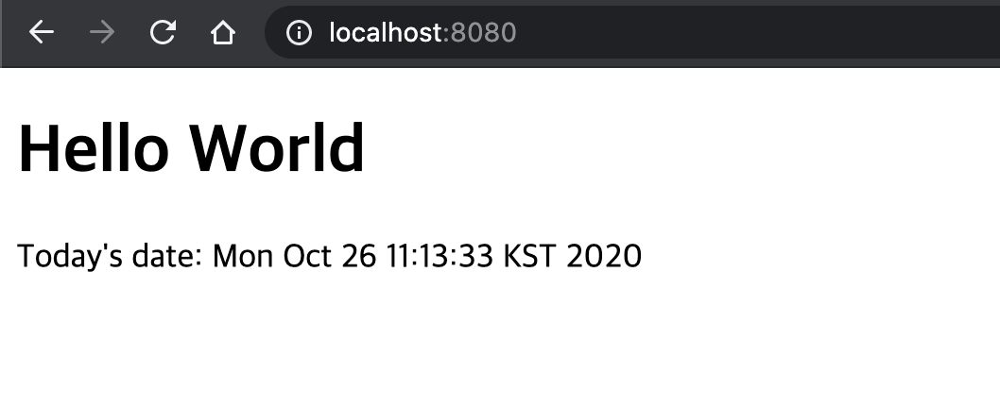

# The Maven Web Appplication   
creating Web Application using corretto-11, Maven in intellij.
 
## Amazon Corretto 11 Installation for macOS
This topic describes how to install and uninstall Amazon Corretto 11 on a host running the Mac OS version 10.13 or later. You must have administrator permissions to install and uninstall Amazon Corretto 11.

[What Is Aamazon Corretto?](https://aws.amazon.com/ko/corretto)

### Install Amazon Corretto 11
1. Download the Mac **.pkg** file from the [Downloads](https://docs.aws.amazon.com/corretto/latest/corretto-11-ug/downloads-list.html) page.

2. Double-click the downloaded file to begin the installation wizard and follow the steps in the wizard.

3. Once the wizard completes, Amazon Corretto 11 is installed in /Library/Java/JavaVirtualMachines/.

You can run the following command in a terminal to get the complete installation path.

<pre>
<code>
/usr/libexec/java_home --verbose
</code>
</pre>

4. Run the following command in the terminal to set the JAVA_HOME variable to the Amazon Corretto 11 version of the JDK. If this was set to another version previously, it is overridden.

<pre>
<code>
export JAVA_HOME=/Library/Java/JavaVirtualMachines/amazon-corretto-11.jdk/Contents/Home
</code>
</pre>


## Installing and Configuring AWS Toolkit plugin for JetBrains 
This readme will notice you about creating a web application using maven in IntelliJ. 
This assumes that you have maven installed in your local machine. If not, check this tutorial of [installing maven](https://maven.apache.org/install.html).

1. Ensure that a [JetBrains IDE supported by AWS Toolkits](https://docs.aws.amazon.com/toolkit-for-jetbrains/latest/userguide/welcome.html#supported-ides) is installed and running.
2. Opne **Setting / Preferences**.
3. On the left side, click **plugin**.
4. On the **Marketplace** tab, in **Search plugins in marketplace**, being entering **'AWS Toolkit'**. and choose **install**.


 
## Creating a new project for JetBrains

For this example, we will be using Corretto 11 and IntelliJ IDEA 2020.2.
1. click **Create New Project**
2. On the left side, click **Maven**. 
3. Select the Project SDK or **New** to add a new SDK. For now, let's tick it and choose **org.apache.maven.archetypes:maven-archetype-webapp**.


Click Next. Populate the GroupId and ArtifactId. Normally, the GroupId is the company name while the ArtifactId is the project name. Click Next to continue creating the project.
1. GroupId is com.awssa or if you have a domain(ex com.example)


In the next window,you will be presented with the Maven installation that you wanted to use. You can use this bundled maven or choose your own maven installation. Click **Next** after selecting your choice.


Once finished, you should see your project structure to something similar below. Click the **Project** tab on the left side to view your project hierarchy. In cased that this tab is not visible, you can show this by clicking the double-square icon located at the lower-left corner of IntelliJ.


## Create the Folder Structure
If IntelliJ didn’t create the **java** and **resources** folder for your project, then just add theses folders manually.
Right-click the **main** folder and select New > Directory.


In the new directory pop up, type java and click OK. This folder will hold our java source codes. Do the same for the resources folder.

Your final folder structure should like similar to this:


you should be edit a index.jsp as below.
```jsp
<%@ page language="java" contentType="text/html; charset=ISO-8859-1"
         pageEncoding="ISO-8859-1"%>
<%@ page import="java.util.*" %>
<!DOCTYPE html PUBLIC "-//W3C//DTD HTML 4.01 Transitional//EN" "http://www.w3.org/TR/html4/loose.dtd">
<html>
<head>
    <meta http-equiv="Content-Type" content="text/html; charset=ISO-8859-1">
    <title>current Date</title>
</head>
<body>
<h1>Hello World</h1>
Today's date: <%= (new java.util.Date()).toString()%>
</body>
</html>
``` 

Before you can use setting, You are able to change **Project SDK** to corretto-11. This Project Structure is on the right side top as below.  


This project SDK is default for all project modules. you should be click **edit** and change **corretto-11**.


## Configrure pom.xml

Open your pom.xml file. Locate the maven.compiler.source and maven.compiler.target and change the version to 1.8 since we wanted to use Java 8.

```xml
 <properties>
    <project.build.sourceEncoding>UTF-8</project.build.sourceEncoding>
    <maven.compiler.source>1.8</maven.compiler.source>
    <maven.compiler.target>1.8</maven.compiler.target>
  </properties>
```

The Amazon Web Services SDK like as below. for Java APIs for building software on AWS cost-effective, scalable, and reliable infrastrurce products.
The AWS Java SDK allows developers to code against APIs for all of Amazon's infrastructure web services (Amazon S3, Amazon EC2, Amazon SQS, Amazon Relational Database Service, Amazon AutoScaling, etc).
```xml
    <dependency>
      <groupId>com.amazonaws</groupId>
      <artifactId>aws-java-sdk</artifactId>
      <version>1.11.885</version>
    </dependency>
    <!-- https://mvnrepository.com/artifact/javax.servlet/javax.servlet-api -->
    <dependency>
      <groupId>javax.servlet</groupId>
      <artifactId>javax.servlet-api</artifactId>
      <version>4.0.1</version>
      <scope>provided</scope>
    </dependency>
```

Next, under the build section, we will add the jetty plugin. Jetty plugin will be our web app container like tomcat, jboss etc.
```xml
    <plugins>
      <!-- Jetty Plugin. Default port is 8080 -->
      <plugin>
        <groupId>org.eclipse.jetty</groupId>
        <artifactId>jetty-maven-plugin</artifactId>
        <version>9.4.33.v20201020</version>
      </plugin>
    </plugins>
```

The final pom.xml should be something similar to this

```xml
<?xml version="1.0" encoding="UTF-8"?>

<project xmlns="http://maven.apache.org/POM/4.0.0" xmlns:xsi="http://www.w3.org/2001/XMLSchema-instance"
  xsi:schemaLocation="http://maven.apache.org/POM/4.0.0 http://maven.apache.org/xsd/maven-4.0.0.xsd">
  <modelVersion>4.0.0</modelVersion>

  <groupId>com.awssa</groupId>
  <artifactId>mavenWebApp</artifactId>
  <version>1.0-SNAPSHOT</version>
  <packaging>war</packaging>

  <name>mavenWebApp Maven Webapp</name>
  <!-- FIXME change it to the project's website -->
  <url>http://www.example.com</url>

  <properties>
    <project.build.sourceEncoding>UTF-8</project.build.sourceEncoding>
    <maven.compiler.source>1.8</maven.compiler.source>
    <maven.compiler.target>1.8</maven.compiler.target>
  </properties>

  <dependencies>
    <dependency>
      <groupId>junit</groupId>
      <artifactId>junit</artifactId>
      <version>4.11</version>
      <scope>test</scope>
    </dependency>
    <dependency>
      <groupId>com.amazonaws</groupId>
      <artifactId>aws-java-sdk</artifactId>
      <version>1.11.885</version>
    </dependency>
    <!-- https://mvnrepository.com/artifact/javax.servlet/javax.servlet-api -->
    <dependency>
      <groupId>javax.servlet</groupId>
      <artifactId>javax.servlet-api</artifactId>
      <version>4.0.1</version>
      <scope>provided</scope>
    </dependency>
  </dependencies>

  <build>
    <plugins>
      <!-- Jetty Plugin. Default port is 8080 -->
      <plugin>
        <groupId>org.eclipse.jetty</groupId>
        <artifactId>jetty-maven-plugin</artifactId>
        <version>9.4.33.v20201020</version>
      </plugin>
    </plugins>

    <finalName>mavenWebApp</finalName>
    <pluginManagement><!-- lock down plugins versions to avoid using Maven defaults (may be moved to parent pom) -->
      <plugins>
        <plugin>
          <artifactId>maven-clean-plugin</artifactId>
          <version>3.1.0</version>
        </plugin>
        <!-- see http://maven.apache.org/ref/current/maven-core/default-bindings.html#Plugin_bindings_for_war_packaging -->
        <plugin>
          <artifactId>maven-resources-plugin</artifactId>
          <version>3.0.2</version>
        </plugin>
        <plugin>
          <artifactId>maven-compiler-plugin</artifactId>
          <version>3.8.0</version>
        </plugin>
        <plugin>
          <artifactId>maven-surefire-plugin</artifactId>
          <version>2.22.1</version>
        </plugin>
        <plugin>
          <artifactId>maven-war-plugin</artifactId>
          <version>3.2.2</version>
        </plugin>
        <plugin>
          <artifactId>maven-install-plugin</artifactId>
          <version>2.5.2</version>
        </plugin>
        <plugin>
          <artifactId>maven-deploy-plugin</artifactId>
          <version>2.8.2</version>
        </plugin>
      </plugins>
    </pluginManagement>
  </build>
</project>
```


## Deploying/Running the Project

Check the console in IntelliJ and wait for the line “Started Jetty Server” to be printed. 


Open your browser and go to localhost:8080. This will show your simple web application in Maven.


